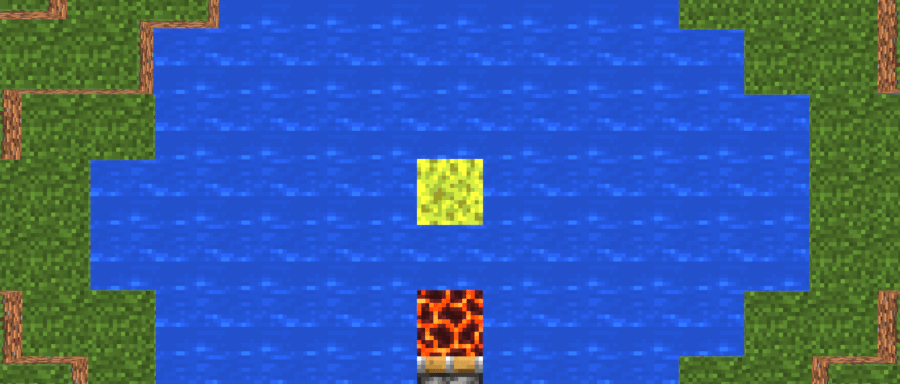
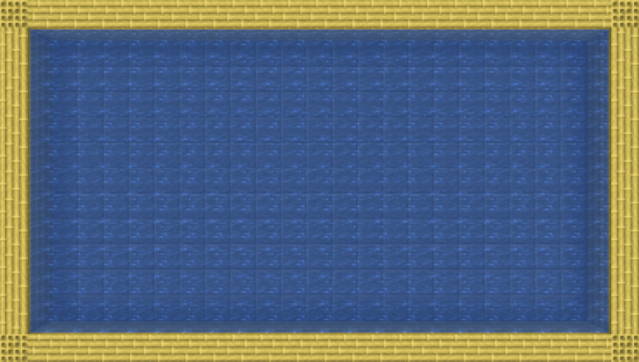
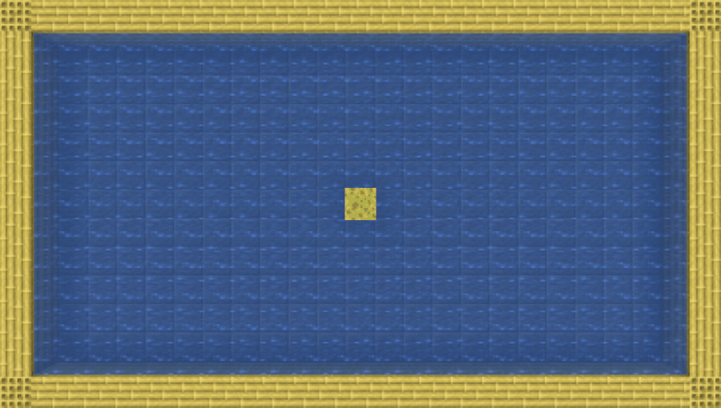
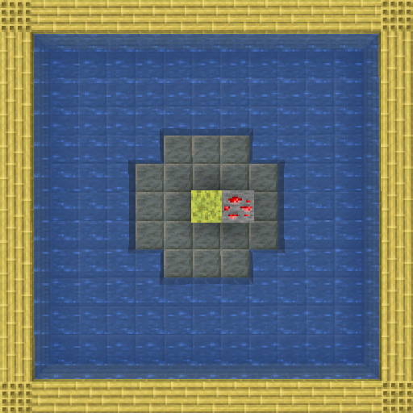
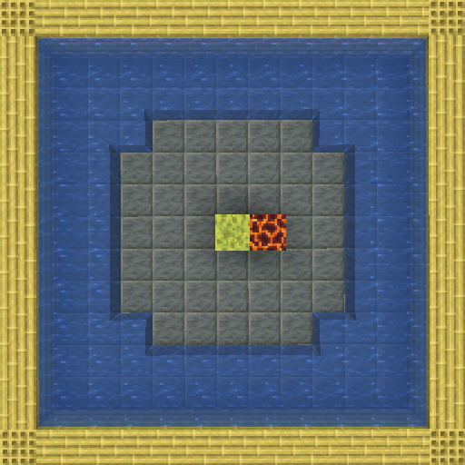
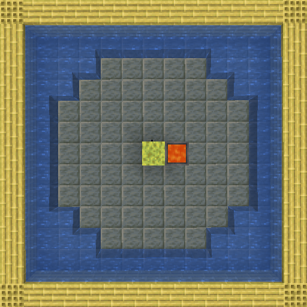
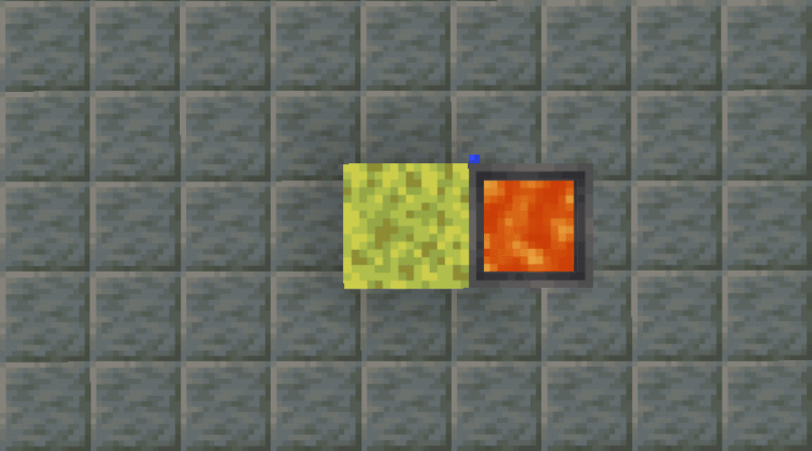

The default behaviour of sponges is adjusted to keep absorbing water after being initially placed. By default this absorption duration is 3 seconds, but can be changed with the game rule `/gamerule durable_sponges:absorption_time_max 3`. The highest value this game rule cna be set to is 10 seconds.

Some light emitting blocks are tagged into the 3 heat sources `low`, `medium` or `high`. If a a sponge or a wet sponge is placed next to one of the heat sources, the sponge will continue to absorb water in a range based on the heat source.

| Low heat                                                   | Medium heat                                                      | High heat                                                    |
| ---------------------------------------------------------- | ---------------------------------------------------------------- | ------------------------------------------------------------ |
| </img> | </img> | </img> |
| A radius of 2 blocks is affected                           | A radius of 3 blocks is affected                                 | A radius of 4 blocks is affected                             |

The absorption range of sponges with heat sources can be set using the following game rules. For each game rule the new radius must be between 1 and 8 blocks.

- `/gamerule durable_sponges:absorption_range_low 2`
- `/gamerule durable_sponges:absorption_range_medium 3`
- `/gamerule durable_sponges:absorption_range_high 4`

List of all heat sources

| Heat level | Heat sources                                                                                                                                                                                                          |
| ---------- | --------------------------------------------------------------------------------------------------------------------------------------------------------------------------------------------------------------------- |
| Low        | <ul><li> Torch </li><li> Copper Torch </li><li> Soul Torch </li><li> Redstone Torch </li><li> Glow Lichen </li><li> Lantern </li><li> Soul Lantern </li><li> Redstone Ore </li><li> Deepslate Redstone Ore </li></ul> |
| Medium     | <ul><li> Magma Block </li><li> Verdant Froglight </li><li> Ochre Froglight </li><li> Pearlescent Froglight </li><li> Glowstone </li><li> Jack o Lantern </li><li> Sea Lantern </li><li> Shroomlight </li></ul>        |
| High       | <ul><li> Lava </li><li> Lava Cauldron </li><li> Fire </li><li> Campfire </li><li> Soul Fire </li><li> Soul Campfire </li></ul>                                                                                        |

The heat sources can be modified using the block tags `durable_sponges/tags/block/(low | medium | high)_heat.json`

If there is a high heat source next to a wet sponge and the sponge has not absorbed any water in the last seconds, the wet sponge will dry to a regular sponge with the next random tick. The delay after absorbing water and the possibility of drying can be changed using the following game rule `/gamerule durable_sponges:delay_before_drying 2`. Setting this game rule to 0 will disable drying wet sponges using high heat sources.

